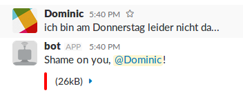

# Shame Bot
## Running bot
1. Grab the repo and run:
```sh
$ composer install
```
2. Add a bot integration in Slack [here](https://slack.com/services/new/bot)
3. Rename config.example.php to config.php and set the slack-token
4. Run from the command line:
```sh
$ php shame-bot.php
```
5. Invite your brand new bot into the channels you'd like it to watch.

## Example


## License
The used library [slack-client](https://github.com/sagebind/slack-client) from [sagebind](https://github.com/sagebind) is licensed under the MIT license. See the [LICENSE](./LICENSE_SAGEBIND) file for details.
